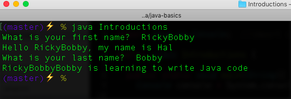

# Java Introductions

A basic Java console app demonstrating input/output via the console.
- See this [tutorial](https://teamtreehouse.com/library/java-basics).

## CONCEPTS REVIEWED

- Strings, Variables, input/output to console, intialize variables/null pointer error

## DEPENDENCIES

- Java v8, Update 161

## SETUP NOTES

- The Java source code is in: Introductions.java
- The Java compiled code is in: Introductions.class


## INTALL AND RUN

- Clone repo
- On Mac, open terminal and change to the java-hello-world directory
- Run Introductions.class, see below...

```java
    java Introductions
```
<p align="center">
  
</p>

## NOTES

### Java Syntax

- File name and class name must be the same name. It is case-sensitive
- Escape character, \n gives a line break
- Java concatinates strings and variables using "+"


### Java Commands

```java
  console.printf("Hello\n");
  console.printf("Hello, %s", firstName);
  console.readLine();
``` 


-------------------------------------------

## REFERENCES

- [TH Java Basics](https://teamtreehouse.com/library/java-basics)
- [Oracle: Characters & Escape Sequences](https://docs.oracle.com/javase/tutorial/java/data/characters.html)
- [Oracle: Java Primative Data Types](https://docs.oracle.com/javase/tutorial/java/nutsandbolts/datatypes.html)
- [Oracle: Java Types, Values, Variables](https://docs.oracle.com/javase/specs/jls/se7/html/jls-4.html)
- [Oracle: Java Tutorial](https://docs.oracle.com/javase/tutorial/java/index.html)
